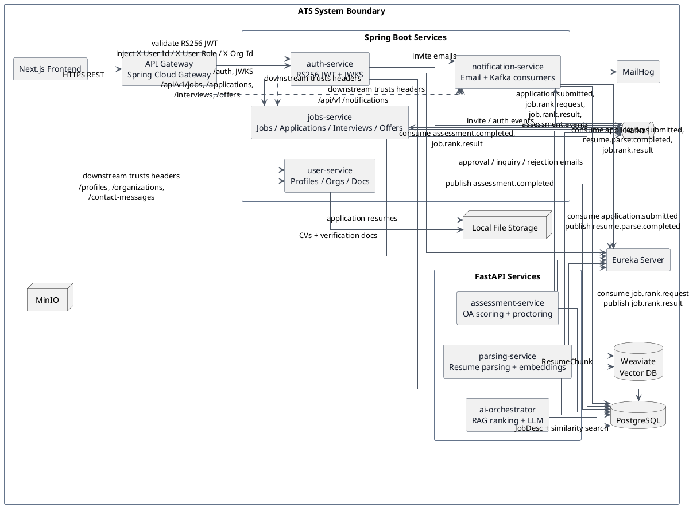
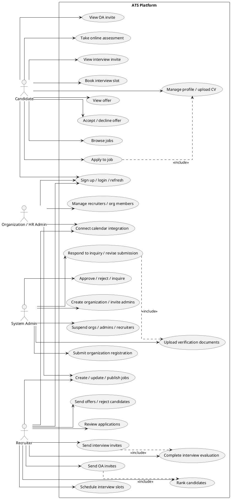
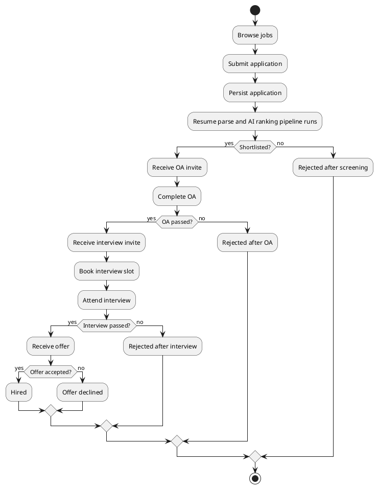
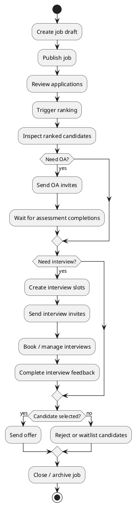
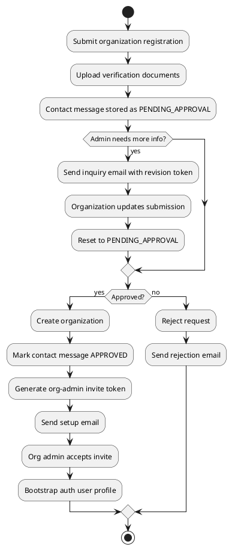

I mapped the implemented backend, frontend, ML, storage, and event paths and kept the diagrams inside the ATS boundary only. The set below is derived from the current codebase, with the Google Calendar integration represented as an internal ATS component rather than an external system.

**1. System Architecture**  
This is the top-level service map: browser traffic enters the gateway, JWT is validated there, trusted headers are injected, and the backend services communicate through REST, Feign, Kafka, PostgreSQL, local storage, and Weaviate.



**2. Use Case Diagram**  
This groups the user-facing capabilities by role: candidate, recruiter, organization admin, and system admin.



**3. ER Diagram**  
This is the single unified data model, grouped by service. It shows the persisted relationships that the code actually enforces or relies on.

```plantuml
@startuml
left to right direction
skinparam shadowing false
skinparam linetype ortho
skinparam packageStyle rectangle
skinparam entityBorderColor #334155
skinparam entityFontColor #111827
skinparam backgroundColor white

package "auth-service" {
  entity "auth_user" as AuthUser {
    *id : UUID
    --
    email : varchar
    password_hash : varchar
    first_name : varchar
    last_name : varchar
    role : Role
    org_id : UUID
    is_suspended : boolean
  }

  entity "refresh_token" as RefreshToken {
    *id : UUID
    --
    user_id : UUID
    token_hash : varchar
    expires_at : timestamp
    revoked : boolean
  }

  entity "invite_token" as InviteToken {
    *id : UUID
    --
    token : UUID
    email : varchar
    role : Role
    org_id : UUID
    first_name : varchar
    last_name : varchar
    expires_at : timestamp
    used : boolean
  }
}

package "user-service" {
  entity "organization" as Organization {
    *id : UUID
    --
    name : varchar
    organization_policies : jsonb
    created_at : timestamp
    is_suspended : boolean
  }

  entity "contact_message" as ContactMessage {
    *id : UUID
    --
    name : varchar
    email : varchar
    message : text
    hr_admin_name : varchar
    company_details : text
    status : ContactMessageStatus
    inquiry_message : text
    rejection_reason : text
    rejected_at : timestamp
    approved_at : timestamp
    approved_organization_id : UUID
    revision_token : varchar
    created_at : timestamp
  }

  entity "user_profile" as UserProfile {
    *id : UUID
    --
    auth_user_id : UUID
    first_name : varchar
    last_name : varchar
    email : varchar
    phone : varchar
    bio : text
    cv_url : varchar
    role : varchar
    org_id : UUID
    years_of_experience : int
    created_at : timestamp
    updated_at : timestamp
  }

  entity "document" as Document {
    *id : UUID
    --
    profile_id : UUID
    contact_message_id : UUID
    filename : varchar
    path : varchar
    content_type : varchar
    file_size : bigint
    uploaded_at : timestamp
  }
}

package "jobs-service" {
  entity "jobs" as Job {
    *id : UUID
    --
    org_id : UUID
    title : varchar
    description : text
    requirements : text
    location : varchar
    employment_type : varchar
    experience_level : varchar
    skills : text[]
    scoring_weights : jsonb
    custom_scoring_rules : jsonb
    status : JobStatus
    created_by : UUID
    assigned_to : UUID
    created_at : timestamp
    updated_at : timestamp
    published_at : timestamp
    closed_at : timestamp
    application_deadline : timestamp
  }

  entity "application" as Application {
    *id : UUID
    --
    job_id : UUID
    candidate_auth_user_id : UUID
    candidate_email : varchar
    candidate_name : varchar
    cover_letter : text
    portfolio_links : text[]
    contact_phone : varchar
    candidate_profile_snapshot : jsonb
    original_file_path : varchar
    original_filename : varchar
    status : ApplicationStatus
    parse_confidence : double
    composite_score : double
    interview_score : double
    ranking_position : int
    oa_score : double
    final_ranking_score : double
    final_rank : int
    is_waitlisted : boolean
    rejection_reason : text
    rejected_at : timestamp
    rejected_by : UUID
    created_at : timestamp
    updated_at : timestamp
  }

  entity "ranking_job" as RankingJob {
    *id : UUID
    --
    job_id : UUID
    status : RankingStatus
    result : jsonb
    created_at : timestamp
    completed_at : timestamp
  }

  entity "assessment_invite" as AssessmentInvite {
    *id : UUID
    --
    job_id : UUID
    application_id : UUID
    candidate_auth_user_id : UUID
    candidate_email : varchar
    job_title : varchar
    organization_name : varchar
    assessment_token : varchar
    assessment_title : varchar
    time_limit_minutes : int
    sent_at : timestamp
    expires_at : timestamp
  }

  entity "interview_invite" as InterviewInvite {
    *id : UUID
    --
    job_id : UUID
    application_id : UUID
    candidate_auth_user_id : UUID
    candidate_email : varchar
    job_title : varchar
    organization_name : varchar
    oa_score : double
    scheduling_url : varchar
    sent_at : timestamp
    expires_at : timestamp
  }

  entity "interview_slots" as InterviewSlot {
    *id : UUID
    --
    job_id : UUID
    recruiter_auth_user_id : UUID
    start_time : timestamp
    end_time : timestamp
    status : SlotStatus
    created_at : timestamp
  }

  entity "interview_bookings" as InterviewBooking {
    *id : UUID
    --
    slot_id : UUID
    application_id : UUID
    candidate_auth_user_id : UUID
    meeting_link : varchar
    status : BookingStatus
    created_at : timestamp
    feedback : text
    rating : int
    technical_score : int
    problem_solving_score : int
    communication_score : int
    behavioral_score : int
    culture_fit_score : int
    recruiter_summary : text
    strengths : text
    weaknesses : text
    hire_recommendation : text
    final_score : double
  }

  entity "offers" as Offer {
    *id : UUID
    --
    application_id : UUID
    token : varchar
    sent_by : UUID
    offer_message : text
    salary : varchar
    start_date : date
    sent_at : timestamp
    accepted_at : timestamp
    declined_at : timestamp
    decline_reason : text
  }

  entity "user_integrations" as UserIntegration {
    *id : UUID
    --
    auth_user_id : UUID
    google_refresh_token : varchar
    created_at : timestamp
    updated_at : timestamp
  }
}

package "ml/parsing-service" {
  entity "parse_results" as ParseResult {
    *id : UUID
    --
    application_id : UUID
    status : varchar
    parsed_data : json
    parse_confidence : float
    chunk_count : int
    source_file_path : varchar
    created_at : timestamp
    completed_at : timestamp
  }
}

package "ml/assessment-service" {
  entity "assessments" as Assessment {
    *id : UUID
    --
    job_id : UUID
    title : varchar
    description : text
    time_limit_minutes : int
    questions : json
    created_by : UUID
    access_token : varchar
    status : varchar
    created_at : timestamp
    updated_at : timestamp
  }

  entity "assessment_submissions" as AssessmentSubmission {
    *id : UUID
    --
    assessment_id : UUID
    candidate_id : UUID
    answers : json
    score : float
    scoring_details : json
    llm_rationale : text
    status : varchar
    started_at : timestamp
    submitted_at : timestamp
    scored_at : timestamp
    created_at : timestamp
  }

  entity "proctoring_events" as ProctoringEvent {
    *id : UUID
    --
    submission_id : UUID
    event_type : varchar
    event_data : json
    timestamp : timestamp
    created_at : timestamp
  }

  entity "llm_audit_logs" as AssessmentLLMAuditLog {
    *id : UUID
    --
    submission_id : UUID
    model_name : varchar
    prompt_hash : varchar
    prompt_template_id : varchar
    input_variables : json
    raw_response : text
    score : float
    created_at : timestamp
  }
}

package "ml/ai-orchestrator" {
  entity "ai_ranking_jobs" as AIRankingJob {
    *id : UUID
    --
    job_id : UUID
    status : varchar
    candidate_ids : json
    results : json
    created_at : timestamp
    completed_at : timestamp
  }

  entity "ai_ranking_results" as AIRankingResult {
    *id : UUID
    --
    ranking_job_id : UUID
    candidate_id : UUID
    application_id : UUID
    semantic_score : float
    assessment_score : float
    interview_score : float
    llm_quality_score : float
    composite_score : float
    summary : text
    evidence_chunks : json
    created_at : timestamp
  }

  entity "ai_llm_audit_logs" as AIRankingAuditLog {
    *id : UUID
    --
    ranking_job_id : UUID
    candidate_id : UUID
    model_name : varchar
    prompt_hash : varchar
    prompt_template_id : varchar
    input_variables : json
    raw_response : text
    created_at : timestamp
  }
}

package "notification-service" {
  entity "notification" as Notification {
    *id : UUID
    --
    recipient_user_id : UUID
    recipient_email : varchar
    type : varchar
    channel : NotificationChannel
    subject : varchar
    body : text
    event_type : varchar
    event_payload : jsonb
    status : NotificationStatus
    sent_at : timestamp
    error_message : text
    created_at : timestamp
  }
}

AuthUser ||--o{ RefreshToken
AuthUser ||--o{ InviteToken
AuthUser ||--|| UserProfile : bootstrap
AuthUser ||--o{ UserIntegration

Organization ||--o{ ContactMessage : approvedOrganizationId
UserProfile ||--o{ Document
ContactMessage ||--o{ Document

Job ||--o{ Application
Job ||--o{ RankingJob
Job ||--o{ InterviewSlot
Job ||--o{ AssessmentInvite
Job ||--o{ InterviewInvite
Job ||--o{ Assessment : job_id

Application ||--o{ ParseResult : application_id
Application ||--o{ AssessmentInvite
Application ||--o{ InterviewInvite
Application ||--o{ Offer
Application ||--o{ InterviewBooking

InterviewSlot ||--o| InterviewBooking

Assessment ||--o{ AssessmentSubmission
AssessmentSubmission ||--o{ ProctoringEvent
AssessmentSubmission ||--o{ AssessmentLLMAuditLog : submission_id

AIRankingJob ||--o{ AIRankingResult
AIRankingJob ||--o{ AIRankingAuditLog

@enduml
```



**4. Class Diagram**  
This is the unified structural map. It groups the frontend modules, gateway, and backend services by package and keeps the many transport DTOs out of the core graph so the diagram stays readable.

```plantuml
@startuml
left to right direction
skinparam shadowing false
skinparam linetype ortho
skinparam packageStyle rectangle
skinparam classAttributeIconSize 0
skinparam backgroundColor white

package "frontend/client" {
  class ApiClient
  class AuthStore
  class ProtectedRoute
  class FileUpload
}

package "api-gateway" {
  class JwtAuthFilter
  class JwksManager
  class RateLimiterFilter
}

package "auth-service" {
  class AuthController
  class AuthService
  class JwtService
  class AuthUser
  class InviteToken
  class RefreshToken
  enum Role
  interface AuthUserRepository
  interface InviteTokenRepository
  interface RefreshTokenRepository
  interface UserServiceClient
  interface NotificationServiceClient
  interface JobServiceClient
}

package "user-service" {
  class ContactMessageController
  class OrganizationController
  class ProfileController
  class InternalProfileController
  class ContactMessageService
  class OrganizationService
  class UserProfileService
  class Organization
  class ContactMessage
  class UserProfile
  class Document
  interface ContactMessageRepository
  interface OrganizationRepository
  interface UserProfileRepository
  interface DocumentRepository
  interface AuthServiceClient
  interface NotificationServiceClient
  class FileStorageConfig
}

package "jobs-service" {
  class JobController
  class ApplicationController
  class RankingController
  class CandidateInterviewController
  class RecruiterInterviewController
  class OfferController
  class AssessmentInviteController
  class InterviewInviteController
  class GoogleIntegrationController

  class JobService
  class ApplicationService
  class RankingService
  class AssessmentInviteService
  class InterviewInviteService
  class InterviewSchedulingService
  class OfferService
  class GoogleCalendarService
  class DeadlineSchedulerService

  class Job
  class Application
  class RankingJob
  class AssessmentInvite
  class InterviewInvite
  class InterviewSlot
  class InterviewBooking
  class Offer
  class UserIntegration

  class HeaderContext
  class FileStorageUtil

  interface JobRepository
  interface ApplicationRepository
  interface RankingJobRepository
  interface AssessmentInviteRepository
  interface InterviewInviteRepository
  interface InterviewSlotRepository
  interface InterviewBookingRepository
  interface OfferRepository
  interface UserIntegrationRepository
  interface OrgServiceClient
  interface UserServiceClient
  interface NotificationServiceClient
}

package "notification-service" {
  class NotificationController
  class NotificationService
  class NotificationEventListener
  class Notification
  interface NotificationRepository
  class KafkaConfig
}

package "ml/parsing-service" {
  class ParseRouter
  class ParserService
  class WeaviateAdapter
  class KafkaConsumerWrapper
  class ParseResult
  class ParseRequest
  class ParseResponse
  class ParseStatusResponse
}

package "ml/assessment-service" {
  class AssessmentRouter
  class ScoringService
  class Assessment
  class AssessmentSubmission
  class ProctoringEvent
  class LLMAuditLog
  class CreateAssessmentRequest
  class AssessmentResponse
  class SubmissionResponse
  class ScoreDetail
  class ProctoringEventRequest
  class ProctoringEventResponse
  class PublishAssessmentCompleted
}

package "ml/ai-orchestrator" {
  class RankingRouter
  class RankingService
  class WeaviateClient
  class RankingJob
  class RankingResult
  class LLMAuditLog
  class RankRequest
  class RankStatusResponse
  class CandidateRankResult
}

ApiClient ..> AuthStore
ProtectedRoute ..> AuthStore
FileUpload ..> ApiClient

JwtAuthFilter --> JwksManager
RateLimiterFilter ..> JwtAuthFilter

AuthController --> AuthService
AuthService --> JwtService
AuthService --> AuthUserRepository
AuthService --> RefreshTokenRepository
AuthService --> InviteTokenRepository
AuthService ..> UserServiceClient
AuthService ..> NotificationServiceClient
AuthService ..> JobServiceClient
JwtService --> AuthUser
InviteToken --> Role
RefreshToken --> AuthUser

ContactMessageController --> ContactMessageService
OrganizationController --> OrganizationService
ProfileController --> UserProfileService
InternalProfileController --> UserProfileService
ContactMessageService --> OrganizationService
ContactMessageService ..> AuthServiceClient
ContactMessageService ..> NotificationServiceClient
ContactMessageService --> ContactMessageRepository
ContactMessageService --> DocumentRepository
OrganizationService --> OrganizationRepository
UserProfileService --> UserProfileRepository
UserProfileService --> DocumentRepository
UserProfileService --> FileStorageConfig
UserProfileService --> UserProfile
ContactMessageService --> ContactMessage
UserProfileService --> Document

JobController --> JobService
ApplicationController --> ApplicationService
ApplicationController --> AssessmentInviteService
ApplicationController --> InterviewInviteService
RankingController --> RankingService
RankingController --> AssessmentInviteService
RankingController --> InterviewInviteService
CandidateInterviewController --> InterviewSchedulingService
RecruiterInterviewController --> InterviewSchedulingService
OfferController --> OfferService
AssessmentInviteController --> AssessmentInviteRepository
InterviewInviteController --> InterviewInviteRepository
GoogleIntegrationController --> UserIntegrationRepository

JobService --> JobRepository
JobService ..> OrgServiceClient
ApplicationService --> ApplicationRepository
ApplicationService --> JobRepository
ApplicationService ..> UserServiceClient
ApplicationService ..> OrgServiceClient
ApplicationService ..> NotificationServiceClient
ApplicationService ..> HeaderContext
ApplicationService ..> FileStorageUtil
RankingService --> RankingJobRepository
RankingService --> ApplicationRepository
RankingService --> JobRepository
RankingService ..> OrgServiceClient
AssessmentInviteService --> ApplicationRepository
AssessmentInviteService --> JobRepository
AssessmentInviteService --> AssessmentInviteRepository
AssessmentInviteService ..> OrgServiceClient
AssessmentInviteService ..> NotificationServiceClient
InterviewInviteService --> ApplicationRepository
InterviewInviteService --> JobRepository
InterviewInviteService --> InterviewInviteRepository
InterviewInviteService ..> OrgServiceClient
InterviewInviteService ..> NotificationServiceClient
InterviewSchedulingService --> InterviewSlotRepository
InterviewSchedulingService --> InterviewBookingRepository
InterviewSchedulingService --> ApplicationRepository
InterviewSchedulingService --> JobRepository
InterviewSchedulingService --> UserIntegrationRepository
InterviewSchedulingService ..> NotificationServiceClient
InterviewSchedulingService ..> GoogleCalendarService
OfferService --> OfferRepository
OfferService --> ApplicationRepository
OfferService --> JobRepository
OfferService ..> OrgServiceClient
OfferService ..> NotificationServiceClient
GoogleIntegrationController --> UserIntegrationRepository
HeaderContext ..> Application
HeaderContext ..> UserIntegration

NotificationController --> NotificationService
NotificationEventListener --> NotificationService
NotificationService --> NotificationRepository
NotificationService ..> KafkaConfig
NotificationService ..> Notification

ParseRouter --> ParserService
ParserService --> ParseResult
ParserService ..> WeaviateAdapter
ParserService ..> KafkaConsumerWrapper

AssessmentRouter --> ScoringService
ScoringService --> Assessment
ScoringService --> AssessmentSubmission
ScoringService --> LLMAuditLog
ScoringService ..> PublishAssessmentCompleted

RankingRouter --> RankingService
RankingService --> WeaviateClient
RankingService --> RankingJob
RankingService --> RankingResult
RankingService --> LLMAuditLog

@enduml
```



**5. Sequence Diagram: Candidate Application Flow**  
This shows the implemented application submission path, including the fan-out to notification and parsing consumers on Kafka.

```plantuml
@startuml
left to right direction
skinparam shadowing false
skinparam linetype ortho
skinparam sequenceMessageAlign center
skinparam responseMessageBelowArrow true

actor Candidate
boundary "Next.js Frontend\n/jobs/{id}/apply" as FE
participant "API Gateway" as GW
control "jobs-service\nApplicationController\nApplicationService" as JOBS
database "PostgreSQL" as PG
collections "Local File Storage" as FS
queue "Kafka" as KAFKA
participant "notification-service" as NOTIF
participant "parsing-service" as PARSE

Candidate -> FE : submit application form + resume
FE -> GW : POST /api/v1/jobs/{jobId}/apply
GW -> JOBS : forward request + trusted headers

opt useProfileData = true
  JOBS -> JOBS : fetch profile data via user-service client
end

JOBS -> FS : store uploaded resume / copy profile CV
JOBS -> PG : save Application(APPLIED)
JOBS -> KAFKA : publish application.submitted

par Notification
  KAFKA -> NOTIF : consume application.submitted
  NOTIF -> Candidate : application received email
and Resume parsing
  KAFKA -> PARSE : consume application.submitted
  PARSE -> PG : create ParseResult(PROCESSING)
  PARSE -> FS : read resume file
  PARSE -> PARSE : extract text / normalize / chunk
  PARSE -> PARSE : compute embeddings
  PARSE -> PARSE : upsert ResumeChunk vectors
  PARSE -> PG : update ParseResult(COMPLETED)
  PARSE -> KAFKA : publish resume.parse.completed
  KAFKA -> NOTIF : consume resume.parse.completed
  NOTIF -> Recruiter : parse complete email or in-app notification
end

JOBS --> FE : ApplicationResponse
@enduml
```

**6. Sequence Diagram: Resume Parsing + AI Scoring Flow**  
This combines the parsing pipeline with the ranking pipeline that is triggered later by the recruiter.

```plantuml
@startuml
left to right direction
skinparam shadowing false
skinparam linetype ortho
skinparam sequenceMessageAlign center
skinparam responseMessageBelowArrow true

actor Recruiter
participant "jobs-service\nRankingController" as JOBS
participant "assessment-service" as ASSESS
queue "Kafka" as KAFKA
participant "ai-orchestrator" as ORCH
participant "jobs-service\nRankResultListener" as JOBS_LISTENER
participant "notification-service" as NOTIF
database "PostgreSQL" as PG
database "Weaviate" as WEAV
participant "jobs-service\nJobController" as JOB_LOOKUP

group OA completion arrives first
  KAFKA -> JOBS_LISTENER : assessment.completed
  JOBS_LISTENER -> PG : mark Application OA_COMPLETED\nstore oaScore if present
  JOBS_LISTENER -> NOTIF : send OA completion email
end

group Recruiter triggers ranking
  Recruiter -> JOBS : POST /api/v1/jobs/{jobId}/rank
  JOBS -> PG : create RankingJob(PENDING)
  JOBS -> KAFKA : publish job.rank.request
  KAFKA -> ORCH : consume job.rank.request
  ORCH -> JOB_LOOKUP : GET /api/v1/jobs/{jobId}
  JOB_LOOKUP --> ORCH : job description
  ORCH -> WEAV : upsert JobDesc
  ORCH -> WEAV : search ResumeChunk by job embedding
  ORCH -> ORCH : compute semantic + assessment + interview + LLM score
  ORCH -> PG : persist AI ranking results + audit logs
  ORCH -> KAFKA : publish job.rank.result
end

group Ranking result applied
  KAFKA -> JOBS_LISTENER : job.rank.result
  JOBS_LISTENER -> PG : update Application compositeScore\nrankingPosition\nstatus SCREENED if still APPLIED
  KAFKA -> NOTIF : consume job.rank.result
  NOTIF -> Recruiter : ranking complete email
end
@enduml
```

**7. Sequence Diagram: Organization Registration / Approval / Password Setup Flow**  
This covers submission, admin review, inquiry, approval, and invite-based account setup.

```plantuml
@startuml
left to right direction
skinparam shadowing false
skinparam linetype ortho
skinparam sequenceMessageAlign center
skinparam responseMessageBelowArrow true

actor "Org / HR Admin" as OrgAdmin
actor "System Admin" as SysAdmin
boundary "Next.js Frontend\n/contact" as FE_CONTACT
boundary "Next.js Frontend\n/platform-admin" as FE_ADMIN
boundary "Next.js Frontend\n/invite/setup" as FE_SETUP
boundary "Next.js Frontend\n/org/inquiry/{token}" as FE_INQUIRY
participant "API Gateway" as GW
control "user-service\nContactMessageController\nContactMessageService" as USER
control "auth-service\nAuthController\nAuthService" as AUTH
participant "notification-service" as NOTIF
database "PostgreSQL" as PG
collections "Local File Storage" as FS

OrgAdmin -> FE_CONTACT : submit registration request
FE_CONTACT -> GW : POST /api/v1/contact-messages
GW -> USER : forward public request
USER -> PG : save ContactMessage(PENDING_APPROVAL)
opt verification documents
  FE_CONTACT -> GW : POST /api/v1/contact-messages/{id}/documents
  GW -> USER : upload file
  USER -> FS : store document under registrations/{id}
  USER -> PG : save Document row
end

SysAdmin -> FE_ADMIN : review submission
FE_ADMIN -> GW : POST /api/v1/contact-messages/{id}/approve
GW -> USER : approve message

alt approval
  USER -> PG : create Organization
  USER -> PG : mark ContactMessage APPROVED\nstore approvedOrganizationId
  USER -> AUTH : POST /auth/internal/invite-org-admin-token
  AUTH -> PG : create InviteToken
  AUTH --> USER : setup token
  USER -> NOTIF : send approval email with setup link
  OrgAdmin -> FE_SETUP : open invite link
  FE_SETUP -> GW : GET /api/v1/auth/invite/validate
  GW -> AUTH : validate invite token
  FE_SETUP -> GW : POST /api/v1/auth/invite/accept
  GW -> AUTH : create AuthUser(ORG_ADMIN)
  AUTH -> USER : POST /internal/profiles/bootstrap
  USER -> PG : create UserProfile
  AUTH -> PG : mark InviteToken used
  AUTH -> NOTIF : optional setup confirmation email
else inquiry
  FE_ADMIN -> GW : POST /api/v1/contact-messages/{id}/inquiry
  GW -> USER : create inquiry
  USER -> PG : set PENDING_RESPONSE + revisionToken
  USER -> NOTIF : send inquiry email with revision link
  OrgAdmin -> FE_INQUIRY : open revision link
  FE_INQUIRY -> GW : GET /api/v1/contact-messages/token/{token}
  GW -> USER : load submission by token
  FE_INQUIRY -> GW : PUT /api/v1/contact-messages/token/{token}
  GW -> USER : update registration submission
  USER -> PG : reset status to PENDING_APPROVAL
else reject
  FE_ADMIN -> GW : POST /api/v1/contact-messages/{id}/reject
  GW -> USER : reject message
  USER -> PG : mark REJECTED
  USER -> NOTIF : send rejection email
end
@enduml
```

**8. Sequence Diagram: Interview / Evaluation Flow**  
This shows the OA completion handoff, interview invite generation, candidate booking, and recruiter evaluation.

```plantuml
@startuml
left to right direction
skinparam shadowing false
skinparam linetype ortho
skinparam sequenceMessageAlign center
skinparam responseMessageBelowArrow true

actor Recruiter
actor Candidate
boundary "Next.js Frontend\n/recruiter/jobs/{id}" as FE_RECRUITER
boundary "Next.js Frontend\n/interview/schedule/{jobId}" as FE_CANDIDATE
participant "API Gateway" as GW
control "jobs-service\nAssessmentInviteService\nInterviewInviteService\nInterviewSchedulingService" as JOBS
participant "assessment-service" as ASSESS
queue "Kafka" as KAFKA
database "PostgreSQL" as PG
participant "notification-service" as NOTIF
participant "Calendar Integration" as CAL

KAFKA -> JOBS : assessment.completed
JOBS -> PG : set Application OA_COMPLETED
JOBS -> NOTIF : send OA completion email

Recruiter -> FE_RECRUITER : send interview invites
FE_RECRUITER -> GW : POST /api/v1/jobs/{jobId}/send-interview-invites
GW -> JOBS : forward request
JOBS -> ASSESS : GET /assessments/{id}/submissions/scored
ASSESS --> JOBS : scored submissions
JOBS -> PG : persist InterviewInvite rows\nset Application INTERVIEW_INVITED
JOBS -> NOTIF : send interview invite email(s)

Candidate -> FE_CANDIDATE : open scheduling page
FE_CANDIDATE -> GW : GET /api/v1/interviews/available-slots/{jobId}
GW -> JOBS : forward request
JOBS -> PG : verify invite + load slots
JOBS --> FE_CANDIDATE : available slots

Candidate -> FE_CANDIDATE : choose slot and confirm booking
FE_CANDIDATE -> GW : POST /api/v1/interviews/book?jobId={jobId}
GW -> JOBS : forward request
JOBS -> PG : mark slot BOOKED\ncreate InterviewBooking\nset Application INTERVIEW_SCHEDULED
JOBS -> CAL : create interview event\nand candidate calendar event
JOBS -> NOTIF : send interview confirmation email
JOBS --> FE_CANDIDATE : booking confirmation

Recruiter -> FE_RECRUITER : complete interview
FE_RECRUITER -> GW : PUT /api/v1/jobs/{jobId}/bookings/{bookingId}/complete
GW -> JOBS : forward request
JOBS -> PG : save feedback, rating,\ninterviewScore, finalRank
JOBS -> NOTIF : send post-interview thank-you email
@enduml
```

**9. Sequence Diagram: Offer Acceptance / Decline Flow**  
This is the offer token flow used by the candidate-facing offer page.

```plantuml
@startuml
left to right direction
skinparam shadowing false
skinparam linetype ortho
skinparam sequenceMessageAlign center
skinparam responseMessageBelowArrow true

actor Recruiter
actor Candidate
boundary "Next.js Frontend\n/recruiter/jobs/{id}/applications/{appId}" as FE_RECRUITER
boundary "Next.js Frontend\n/offers/{token}" as FE_CANDIDATE
participant "API Gateway" as GW
control "jobs-service\nOfferController\nOfferService" as JOBS
database "PostgreSQL" as PG
participant "notification-service" as NOTIF

Recruiter -> FE_RECRUITER : send offer
FE_RECRUITER -> GW : POST /api/v1/jobs/{jobId}/applications/{appId}/offer
GW -> JOBS : forward request
JOBS -> PG : create Offer(token)\nset Application OFFER_SENT
JOBS -> NOTIF : send offer email with token link
JOBS --> FE_RECRUITER : OfferResponse

Candidate -> FE_CANDIDATE : open offer page
FE_CANDIDATE -> GW : GET /api/v1/offers/{token}
GW -> JOBS : forward request
JOBS -> PG : load offer + application + job
JOBS --> FE_CANDIDATE : OfferResponse

alt accept
  Candidate -> FE_CANDIDATE : accept offer
  FE_CANDIDATE -> GW : POST /api/v1/offers/{token}/accept
  GW -> JOBS : forward request
  JOBS -> PG : set Offer acceptedAt\nset Application OFFER_ACCEPTED
  JOBS -> NOTIF : notify recruiter about acceptance
  JOBS --> FE_CANDIDATE : accepted
else decline
  Candidate -> FE_CANDIDATE : decline offer + reason
  FE_CANDIDATE -> GW : POST /api/v1/offers/{token}/decline
  GW -> JOBS : forward request
  JOBS -> PG : set Offer declinedAt / reason\nset Application OFFER_DECLINED
  JOBS -> NOTIF : notify recruiter about decline
  JOBS --> FE_CANDIDATE : declined
end
@enduml
```

**10. Activity Diagram: Candidate Hiring Workflow**  
This is the end-to-end candidate journey from application through possible hire.



**11. Activity Diagram: Recruiter Workflow**  
This captures the recruiter-side operating loop implemented by jobs-service and the frontend.



**12. Activity Diagram: Organization Onboarding Workflow**  
This is the public registration plus admin approval loop.



**13. Component Diagram**  
This is the internal component map. It is more detailed than the system architecture diagram and shows the main code modules, listeners, clients, and pipelines.

```plantuml
@startuml
left to right direction
skinparam shadowing false
skinparam linetype ortho
skinparam componentStyle rectangle
skinparam packageStyle rectangle
skinparam backgroundColor white
skinparam defaultTextAlignment center

package "frontend/client" as FE_PKG {
  component "pages / app router" as FE_PAGES
  component "lib/api.ts" as FE_API
  component "lib/auth.ts" as FE_AUTH
  component "components/\nProtectedRoute, FileUpload,\nNavbar, JobCard..." as FE_UI
}

package "api-gateway" as GW_PKG {
  component "RateLimiterFilter" as GW_RATE
  component "JwtAuthFilter" as GW_JWT
  component "JwksManager" as GW_JWKS
}

package "auth-service" as AUTH_PKG {
  component "AuthController" as AUTH_CTRL
  component "AuthService" as AUTH_SVC
  component "JwtService" as AUTH_JWT
  component "JWKS endpoint" as AUTH_JWKS
  component "AuthUserRepository" as AUTH_REPO
  component "InviteTokenRepository" as AUTH_INVITE_REPO
  component "RefreshTokenRepository" as AUTH_REFRESH_REPO
}

package "user-service" as USER_PKG {
  component "ContactMessageController" as USER_CONTACT_CTRL
  component "OrganizationController" as USER_ORG_CTRL
  component "ProfileController" as USER_PROFILE_CTRL
  component "InternalProfileController" as USER_INTERNAL_CTRL
  component "ContactMessageService" as USER_CONTACT_SVC
  component "OrganizationService" as USER_ORG_SVC
  component "UserProfileService" as USER_PROFILE_SVC
  component "FileStorageConfig / FileUtils" as USER_FS
  component "User / Org / Document repositories" as USER_REPOS
  component "AuthServiceClient" as USER_AUTH_CLIENT
  component "NotificationServiceClient" as USER_NOTIF_CLIENT
}

package "jobs-service" as JOBS_PKG {
  component "JobController" as JOBS_JOB_CTRL
  component "ApplicationController" as JOBS_APP_CTRL
  component "RankingController" as JOBS_RANK_CTRL
  component "CandidateInterviewController" as JOBS_CAND_INT_CTRL
  component "RecruiterInterviewController" as JOBS_REC_INT_CTRL
  component "OfferController" as JOBS_OFFER_CTRL
  component "AssessmentInviteController" as JOBS_ASSESS_CTRL
  component "InterviewInviteController" as JOBS_INVITE_CTRL
  component "GoogleIntegrationController" as JOBS_GOOGLE_CTRL

  component "JobService" as JOBS_JOB_SVC
  component "ApplicationService" as JOBS_APP_SVC
  component "RankingService" as JOBS_RANK_SVC
  component "AssessmentInviteService" as JOBS_ASSESS_SVC
  component "InterviewInviteService" as JOBS_INVITE_SVC
  component "InterviewSchedulingService" as JOBS_SCHED_SVC
  component "OfferService" as JOBS_OFFER_SVC
  component "GoogleCalendarService" as JOBS_CAL_SVC

  component "AssessmentCompletedListener" as JOBS_ASSESS_LISTENER
  component "RankResultListener" as JOBS_RANK_LISTENER
  component "HeaderContext / FileStorageUtil" as JOBS_UTIL
  component "Feign clients\nOrg / User / Notification" as JOBS_CLIENTS
  component "KafkaTemplate + listeners" as JOBS_KAFKA
}

package "notification-service" as NOTIF_PKG {
  component "NotificationController" as NOTIF_CTRL
  component "NotificationService" as NOTIF_SVC
  component "NotificationEventListener" as NOTIF_LISTENER
  component "NotificationRepository" as NOTIF_REPO
  component "JavaMailSender" as NOTIF_MAIL
}

package "ml/parsing-service" as PARSE_PKG {
  component "FastAPI routes" as PARSE_CTRL
  component "parser_service.parse_resume" as PARSE_PIPE
  component "Kafka consumer" as PARSE_KAFKA
  component "WeaviateAdapter" as PARSE_WEAV
  component "ParseResult ORM" as PARSE_DB
}

package "ml/assessment-service" as ASSESS_PKG {
  component "FastAPI routes" as ASSESS_CTRL
  component "scoring_service.score_submission" as ASSESS_SCORE
  component "kafka_producer.publish_assessment_completed" as ASSESS_KAFKA
  component "Assessment / Submission ORM" as ASSESS_DB
}

package "ml/ai-orchestrator" as ORCH_PKG {
  component "FastAPI routes" as ORCH_CTRL
  component "ranking_service.rank_candidates" as ORCH_PIPE
  component "Kafka consumer" as ORCH_KAFKA
  component "WeaviateClient" as ORCH_WEAV
  component "RankingJob / Result ORM" as ORCH_DB
}

FE_PAGES --> FE_API
FE_PAGES --> FE_AUTH
FE_PAGES --> FE_UI

GW_JWT --> GW_JWKS
GW_RATE ..> GW_JWT

AUTH_CTRL --> AUTH_SVC
AUTH_SVC --> AUTH_JWT
AUTH_SVC --> AUTH_REPO
AUTH_SVC --> AUTH_INVITE_REPO
AUTH_SVC --> AUTH_REFRESH_REPO
AUTH_SVC ..> USER_AUTH_CLIENT
AUTH_SVC ..> USER_NOTIF_CLIENT
AUTH_JWKS ..> AUTH_JWT

USER_CONTACT_CTRL --> USER_CONTACT_SVC
USER_ORG_CTRL --> USER_ORG_SVC
USER_PROFILE_CTRL --> USER_PROFILE_SVC
USER_INTERNAL_CTRL --> USER_PROFILE_SVC
USER_CONTACT_SVC --> USER_ORG_SVC
USER_CONTACT_SVC ..> USER_AUTH_CLIENT
USER_CONTACT_SVC ..> USER_NOTIF_CLIENT
USER_CONTACT_SVC --> USER_REPOS
USER_PROFILE_SVC --> USER_FS
USER_PROFILE_SVC --> USER_REPOS

JOBS_JOB_CTRL --> JOBS_JOB_SVC
JOBS_APP_CTRL --> JOBS_APP_SVC
JOBS_RANK_CTRL --> JOBS_RANK_SVC
JOBS_ASSESS_CTRL --> JOBS_ASSESS_SVC
JOBS_INVITE_CTRL --> JOBS_INVITE_SVC
JOBS_CAND_INT_CTRL --> JOBS_SCHED_SVC
JOBS_REC_INT_CTRL --> JOBS_SCHED_SVC
JOBS_OFFER_CTRL --> JOBS_OFFER_SVC
JOBS_GOOGLE_CTRL --> JOBS_CAL_SVC
JOBS_JOB_SVC ..> JOBS_CLIENTS
JOBS_APP_SVC ..> JOBS_CLIENTS
JOBS_RANK_SVC ..> JOBS_KAFKA
JOBS_ASSESS_SVC ..> JOBS_CLIENTS
JOBS_INVITE_SVC ..> JOBS_CLIENTS
JOBS_SCHED_SVC ..> JOBS_CAL_SVC
JOBS_SCHED_SVC ..> JOBS_CLIENTS
JOBS_ASSESS_LISTENER ..> JOBS_CLIENTS
JOBS_RANK_LISTENER ..> JOBS_CLIENTS
JOBS_UTIL ..> JOBS_APP_SVC

NOTIF_CTRL --> NOTIF_SVC
NOTIF_LISTENER --> NOTIF_SVC
NOTIF_SVC --> NOTIF_REPO
NOTIF_SVC --> NOTIF_MAIL

PARSE_CTRL --> PARSE_PIPE
PARSE_KAFKA --> PARSE_PIPE
PARSE_PIPE --> PARSE_WEAV
PARSE_PIPE --> PARSE_DB

ASSESS_CTRL --> ASSESS_SCORE
ASSESS_SCORE --> ASSESS_DB
ASSESS_SCORE ..> ASSESS_KAFKA

ORCH_CTRL --> ORCH_PIPE
ORCH_KAFKA --> ORCH_PIPE
ORCH_PIPE --> ORCH_WEAV
ORCH_PIPE --> ORCH_DB

@enduml
```



If you want, I can next split these into individual .puml files or tune them for a specific PlantUML renderer or docs pipeline.